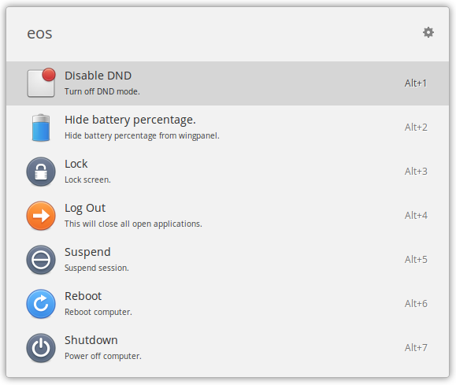

A [Ulauncher](https://ulauncher.io/) extension to support [eOS](https://elementary.io/).

Actions are performed using [`dbus-send`](https://dbus.freedesktop.org/doc/dbus-send.1.html) and [`gsettings`](https://developer.gnome.org/gio/stable/GSettings.html).

#### Possible actions:
 - `Suspend` computer. Search strings: _sleep_, _suspend_
 - `Restart` computer. Search strings: _reboot_, _restart_
 - `PowerOff` computer. Search strings: _shutdown_, _power-off_
 - `Lock` computer. Search strings: _lock_
 - `LogOut` from current sesstion. Search string: _logout_
 - `DND`, toggle Do Not Disturb mode. Search strings: _dnd_
 - `Show/Hide battery %`,  toggle battery percentage. Search string: _battery_

Icons are part of the [elementary icons](https://github.com/elementary/icons).

#### Notes:
_Some actions may work in other DEs, but this is beyond the scope of this extension._

_This extension was inspired by [Exit Gnome](https://github.com/leinardi/ulauncher-exit-gnome)._